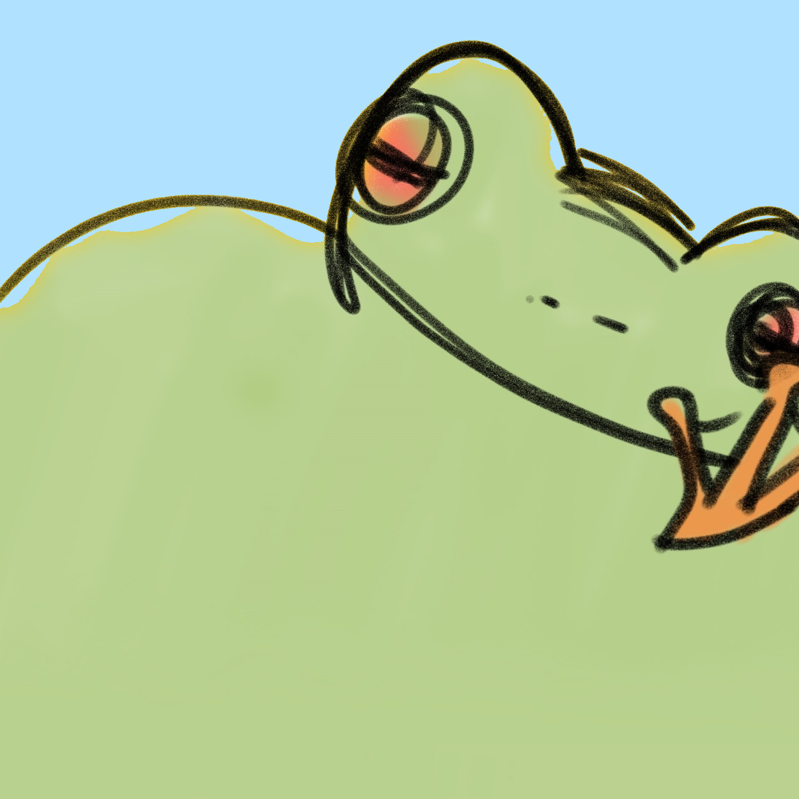

 

  

  <h3 align="center">Froggy Web</h3>

  

    Landing page and dashboard for <a href="https://github.com/danielnaoexiste/froggy-bot">Froggy Bot</a>.
     
     
    <a href="https://github.com/danielnaoexiste/froggy-web-ts/issues">Report Bug</a>
    ·
    <a href="https://github.com/danielnaoexiste/froggy-web-ts/issues">Request Feature</a>
  

<!-- ABOUT THE PROJECT -->

## About The Project

Froggy is a free, open-source, customizable general-purpose bot for Discord servers, built on top of discordjs. It features strong administration features, fun and engaging anime-based reactions and interactions (powered by [OtakuGIFs](https://otakugifs.xyz/)), and tarot readings.

### Web Built With

[![React][React]][React-url]
[![Vercel][Vercel]][Vercel-url]
[![Typescript][Typescript]][Typescript-url]
[![Tailwind][Tailwind]][Tailwind-url]

## License

Distributed under the MIT License. See `LICENSE` for more information.

<!-- MARKDOWN LINKS & IMAGES -->
<!-- https://www.markdownguide.org/basic-syntax/#reference-style-links -->

[Typescript]: https://img.shields.io/badge/TypeScript-007ACC?style=for-the-badge&logo=typescript&logoColor=white
[Typescript-url]: https://www.typescriptlang.org/
[React]: https://img.shields.io/badge/React-20232A?style=for-the-badge&logo=react&logoColor=61DAFB
[React-url]: https://react.dev/
[Tailwind]: https://img.shields.io/badge/Tailwind_CSS-38B2AC?style=for-the-badge&logo=tailwind-css&logoColor=white
[Tailwind-url]: https://tailwindcss.com/
[Vercel]: https://img.shields.io/badge/Vercel-000000?style=for-the-badge&logo=vercel&logoColor=white
[Vercel-url]: https://vercel.com/
